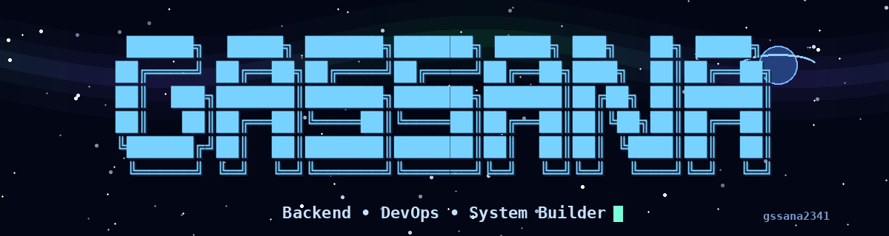

<div align="center">



<br>

### `BACKEND • DEVOPS • SYSTEM BUILDER`

<sub>
Building reliable systems, exploring cloud infrastructure,<br>
and improving one deployment at a time.
</sub>

<br><br>

<a href="https://github.com/gssana2341?tab=repositories">
  
</a>
&nbsp;
<a href="mailto:zoomgamer807@gmail.com">
  
</a>

</div>

<br>

---

## `> boot_sequence`

```bash
$ whoami
Gassana

$ role
Digital Technology Student

$ location
Thailand

$ focus
Backend Development
DevOps & CI/CD
Cloud Infrastructure
System Architecture

$ status
Building systems. Learning every day.
```

---

## `> about_transmission`

```ts
const gassana = {
  username: "gssana2341",
  role: "Backend • DevOps • System Builder",
  education: "Digital Technology",
  location: "Thailand",

  interests: [
    "Backend Development",
    "Cloud Infrastructure",
    "CI/CD Automation",
    "Database Architecture",
    "IoT Systems"
  ],

  philosophy: "Code → Build → Deploy → Monitor → Improve"
};
```

I enjoy designing system workflows, connecting services, managing infrastructure,  
and turning ideas into systems that can actually be deployed and used.

My main interests are backend services, automation, cloud infrastructure,  
databases, IoT platforms, and developer tooling.

---

## `> core_modules`

<table>
<tr>
<td width="33%" valign="top">

### `01 // BACKEND`

Building APIs, authentication systems, service integrations, and backend workflows.

```text
REST API
Authentication
Microservices
System Integration
```

</td>
<td width="33%" valign="top">

### `02 // DEVOPS`

Automating build, deployment, infrastructure, and development workflows.

```text
Docker
Linux
CI/CD
Monitoring
```

</td>
<td width="33%" valign="top">

### `03 // SYSTEM`

Designing how applications, databases, devices, and cloud services communicate.

```text
Architecture
Database Design
Cloud Systems
IoT Platforms
```

</td>
</tr>
</table>

---

## `> technology_stack`

<div align="center">


<br><br>

```text
Rust • Python • TypeScript • Node.js • PostgreSQL
Docker • Linux • Google Cloud • Git
```

</div>

---

## `> selected_operations`

<table>
<tr>
<td width="50%" valign="top">

### `LAUNCHLESS`

Serverless platform concept designed to simplify application deployment and infrastructure management.

```text
Backend • Cloud • DevOps
```

**Mission**

Create a platform where developers can deploy applications without managing complicated infrastructure manually.

</td>
<td width="50%" valign="top">

### `SMART INSOLE SYSTEM`

IoT health platform connecting smart sensor insoles, ESP32 devices, mobile applications, and cloud services.

```text
IoT • ESP32 • BLE • Backend
```

**Mission**

Collect sensor information and transform it into useful health and movement insights.

</td>
</tr>

<tr>
<td width="50%" valign="top">

### `IOT SENSOR PLATFORM`

Device-to-cloud platform for receiving, processing, storing, and monitoring sensor information.

```text
API • PostgreSQL • Docker
```

**Mission**

Build a reliable communication flow between sensors, gateways, backend services, and monitoring dashboards.

</td>
<td width="50%" valign="top">

### `AI TASK APPLICATION`

Task management application with AI assistance, customizable workflows, and team collaboration.

```text
Flutter • Firebase • AI
```

**Mission**

Help users organize personal and team tasks through multiple views and AI-powered commands.

</td>
</tr>
</table>

---

## `> infrastructure_map`

```text
CLIENT / DEVICE
       │
       ▼
   API GATEWAY
       │
       ▼
 BACKEND SERVICE
       │
       ├────► DATABASE
       │
       ├────► OBJECT STORAGE
       │
       └────► MONITORING
                │
                ▼
         BUILD • DEPLOY • IMPROVE
```

---

## `> system_capabilities`

```yaml
backend:
  - API design
  - Authentication workflows
  - Database integration
  - Service communication

devops:
  - Docker containerization
  - Linux environments
  - CI/CD pipelines
  - Cloud deployment

database:
  - PostgreSQL
  - Data modeling
  - Access control
  - Backup planning

infrastructure:
  - Google Cloud
  - Serverless architecture
  - Monitoring concepts
  - Network configuration

iot:
  - ESP32
  - BLE communication
  - Sensor data ingestion
  - Device-to-cloud systems
```

---

## `> current_mission`

```text
BACKEND & DEVOPS PORTFOLIO

[████████░░] 80%

+ Build production-style backend projects
+ Improve Linux and Docker knowledge
+ Create automated CI/CD workflows
+ Learn Kubernetes and Terraform
+ Study monitoring and observability
+ Prepare for technical interviews
```

---

## `> learning_path`

<table>
<tr>
<td width="25%" align="center">

### `BUILD`

Backend APIs  
Database systems  
Authentication

</td>
<td width="25%" align="center">

### `SHIP`

Docker images  
CI/CD pipelines  
Cloud deployment

</td>
<td width="25%" align="center">

### `OBSERVE`

Logs  
Metrics  
Monitoring

</td>
<td width="25%" align="center">

### `IMPROVE`

Architecture  
Performance  
Reliability

</td>
</tr>
</table>

---

## `> github_telemetry`

<div align="center">


</div>

<br>

<div align="center">


</div>

---

## `> communication_channel`

<div align="center">

```text
OPEN FOR

Backend Projects
DevOps Projects
Cloud Infrastructure
IoT Platforms
Technical Collaboration
```

<br>

<a href="mailto:zoomgamer807@gmail.com">
  
</a>

<a href="https://github.com/gssana2341">
  
</a>

</div>

---

<div align="center">


<br><br>

```text
╭──────────────────────────────────────────────╮
│                                              │
│              SYSTEM STATUS                   │
│                                              │
│                 ONLINE                       │
│                                              │
│     CODE → BUILD → DEPLOY → MONITOR           │
│                    ↓                         │
│                 IMPROVE                      │
│                                              │
╰──────────────────────────────────────────────╯
```

<sub>
Thanks for visiting my system.
</sub>

</div>
