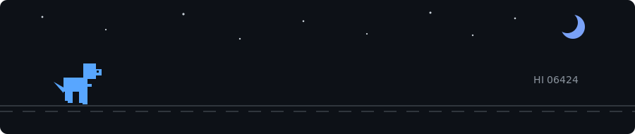

# GSSANA

---

### Designing systems that actually work. Building backend and cloud infrastructure.
Automate. Deploy. Monitor. Improve.

 

Systems must remain operational, even in the shadows. 🦖

 
 

[ Explore Projects ](https://github.com/gssana2341?tab=repositories) | [ Contact Me ](mailto:zoomgamer807@gmail.com)

 
 

 

---

## Compass: `whoami`

<table width="100%" cellpadding="10">
<tr>
<td width="60%" valign="top">

### Profile

- **Name:** Gassana
- **Location:** Thailand
- **Education:** Digital Technology @ Suranaree University of Technology
- **Status:** Building, learning, improving — every day

### Primary Focus

I enjoy architecting complete systems — tracing data flow from devices to APIs, databases, deployment pipelines, and cloud infrastructure.

> DevOps is not a role, it's a culture of efficiency.

</td>
<td width="40%" valign="top" align="center">

</td>
</tr>
</table>

 

---

## Technical Stack

The tools I use to build scalable and reliable systems. (Icons removed for a cleaner look)

| Category | Skills |
| :--- | :--- |
| **Backend** | Rust | Python | TypeScript | Node.js |
| **Database** | PostgreSQL | MySQL | Redis | Firebase |
| **Infrastructure** | Docker | GitHub Actions | Linux | Nginx | GCP |
| **DevOps** | Git | Kubernetes (Learning) | Terraform (Learning) |
| **Tools** | VSCode | Postman | Figma |

 

---

## System Workflow: `automation-pipeline`

 

---

## Featured Projects

<table width="100%" cellpadding="10">
<tr>
<td width="50%" valign="top">

### Launchless

A Serverless platform concept focused on simplifying application deployment and infrastructure management.

`Cloud` `Backend` `DevOps` `Architecture`

</td>
<td width="50%" valign="top">

### Smart Insole System

An IoT health platform utilizing ESP32, BLE, mobile applications, and cloud services for data analysis.

`IoT` `ESP32` `Backend` `Cloud` `HealthTech`

</td>
</tr>
<tr>
<td width="50%" valign="top">

### IoT Sensor Platform

A device-to-cloud platform designed for receiving, storing, and monitoring large-scale sensor data.

`API` `PostgreSQL` `Docker` `Data Engineering`

</td>
<td width="50%" valign="top">

### AI Task Application

A task management application featuring AI assistance for optimization and team collaboration tools.

`Flutter` `Firebase` `AI` `Mobile`

</td>
</tr>
</table>

 

---

## Current Objectives: `learning-path`

I am currently focused on mastering these advanced cloud technologies.

  <code style="background-color: #326CE5; color: white; padding: 5px 10px; border-radius: 5px;">Kubernetes (Learning)</code>
  &nbsp;
  <code style="background-color: #844FBA; color: white; padding: 5px 10px; border-radius: 5px;">Terraform (Learning)</code>
  &nbsp;
  <code style="background-color: #F46800; color: white; padding: 5px 10px; border-radius: 5px;">Prometheus / Grafana (Improving)</code>

 

---

 

 
 

> **Code → Build → Deploy → Improve**
 
Thanks for visiting my profile. Let's build something useful.
 
© GSSANA

